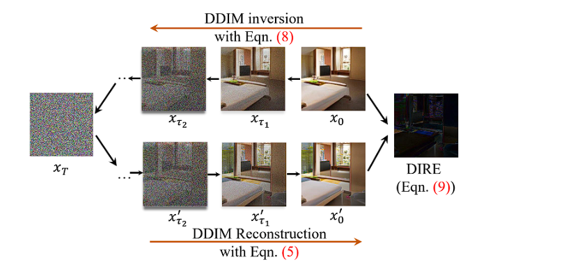

# Deepfake_Detection

We can use a Diffusion Model for generating a image from DIRE'S [Paper](https://github.com/ZhendongWang6/DIRE/blob/main/guided-diffusion/README.md)

Additionally this [Paper](https://paperswithcode.com/paper/cifake-image-classification-and-explainable) implements explainable AI via Gradient Class Activation Mapping(GRAD-CAM) to explore which features within the images are useful for classification. Interpretation reveals interesting concepts within the image, in particular, noting that the actual entity itself does not hold useful information for classification; instead, the model focuses on small visual imperfections in the background of the images.

Paper 2&3 Key Features: DIRE(DIffusion Reconstruction Error) & AEROBLADE(autoencoder reconstruction-based latent diffusion detection)

- Reconstruction Error-Based Detection: Utilizes discrepancies in reconstruction accuracy to detect generated images with high precision.

- Can use pretrained AE or GANs or Diffusion Models for image synthesis for reconstruction rate

- No Training Required: Unlike other methods, AEROBLADE does not rely on extensive model training, making it simple and efficient.

- Will help in detection of image generated by LDMs specifically due to their usage of  the low-resolution latent space of a pre-trained autoencoder

V2 From https://www.kaggle.com/code/guptaachal02/fine-tuning-cnn where he has finetuned various CNNs for various base models for achieving a good accuracy.

V1's AE didnt perform well leading to a poor confusion matrix

V3 and V4 focus on using simple CNNs for binary classification of 'REAL/FAKE' while using GRAD-CAM

Here's a [BLOG](https://www.kaggle.com/datasets/birdy654/cifake-real-and-ai-generated-synthetic-images/discussion/406489) indicating use of Resnet on CIFAKE Dataset training with 10000 epochs obtaining 87% accuracy on test data.

I infer on having using architecture like Resnet with deep network(around 50 layers) and finding the layers which dictates the  judgement for fake on various scenarious by trial and error.

  

