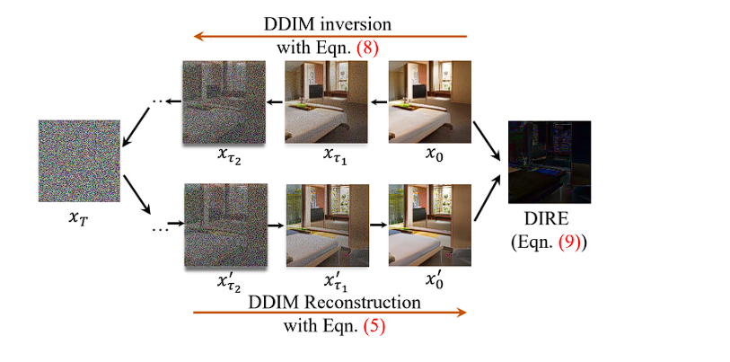
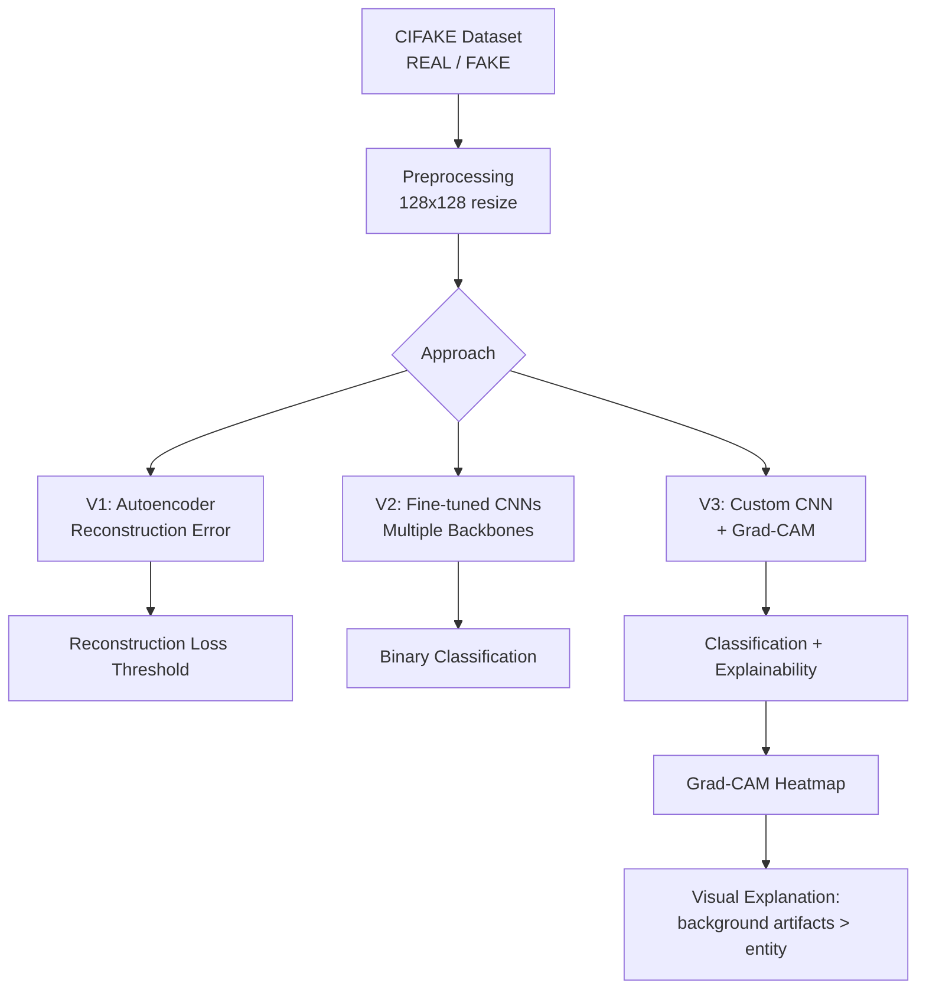

# Deepfake Detection

Multi-approach deepfake image detection system exploring autoencoders, fine-tuned CNNs, and Grad-CAM explainability on the CIFAKE dataset.

<p align="center">
  
</p>

## Overview

This project investigates multiple approaches to detecting AI-generated images, progressing through three versions: autoencoder-based reconstruction error detection, fine-tuned CNN classifiers, and a custom CNN with Grad-CAM visualization to understand which image regions drive the classification decision.


```mermaid
graph TB
    A[CIFAKE Dataset<br/>REAL / FAKE] --> B[Preprocessing<br/>128x128 resize]

    B --> C{Approach}
    C --> D[V1: Autoencoder<br/>Reconstruction Error]
    C --> E[V2: Fine-tuned CNNs<br/>Multiple Backbones]
    C --> F[V3: Custom CNN<br/>+ Grad-CAM]

    D --> G[Reconstruction Loss Threshold]
    E --> H[Binary Classification]
    F --> I[Classification + Explainability]

    I --> J[Grad-CAM Heatmap]
    J --> K[Visual Explanation:<br/>background artifacts > entity]
```

## Approaches

| Version | Method | Key Finding |
|:--|:--|:--|
| V1 | Autoencoder reconstruction error | Poor confusion matrix -- reconstruction error insufficient for CIFAKE |
| V2 | Fine-tuned CNNs (multiple backbones) | Improved accuracy with pre-trained feature extractors |
| V3 | Custom CNN + Grad-CAM | Binary classification with visual explainability |

### Research Context

Based on techniques from:
- **DIRE** (Diffusion Reconstruction Error): Uses reconstruction discrepancies to detect generated images
- **AEROBLADE**: Autoencoder reconstruction-based detection for latent diffusion models
- **CIFAKE paper**: Grad-CAM reveals models focus on background imperfections rather than the entity itself

## Dataset

- **Source**: [CIFAKE](https://www.kaggle.com/datasets/birdy654/cifake-real-and-ai-generated-synthetic-images) on Kaggle
- **Classes**: REAL, FAKE (AI-generated synthetic images)
- **Image size**: 128x128 RGB
- **Training**: 1,000 images per class (configurable)

## Quick Start

```bash
git clone https://github.com/Akasxh/Deepfake_Detection.git
cd Deepfake_Detection

# V3 (recommended) -- Custom CNN + Grad-CAM
jupyter notebook DeepFake_V3.ipynb

# V2 -- Fine-tuned CNNs
jupyter notebook Deepfake_V2.ipynb

# V1 -- Autoencoder approach
jupyter notebook Deepfake_V1.ipynb
```

## Project Structure

```
Deepfake_Detection/
├── Deepfake_V1.ipynb    # Autoencoder-based detection
├── Deepfake_V2.ipynb    # Fine-tuned CNN experiments
├── DeepFake_V3.ipynb    # Custom CNN + Grad-CAM (final)
├── image.png            # V1 confusion matrix
└── README.md
```

## Tech Stack

- **Framework**: TensorFlow/Keras
- **Models**: Custom CNN, pre-trained backbones (ResNet candidates)
- **Explainability**: Grad-CAM (Gradient-weighted Class Activation Mapping)
- **Data**: OpenCV, NumPy, Kaggle API
- **Visualization**: matplotlib, seaborn
